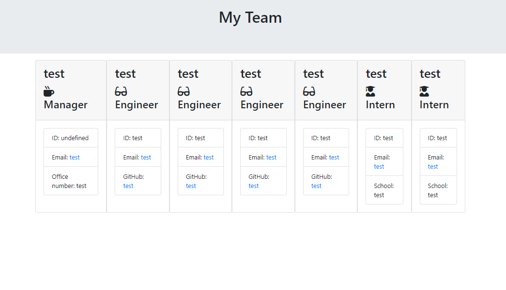

# team-profile-gen

## Description

The goal of this project was to create a Node.js command-line application which takes information about employees on a software engineering team and then generates a HTML webpage that displays the information for each person entered.

## Installation & Usage

Since this is a project built with Node.js, you need to install the dependencies. You can do this by running **npm install**

Use the deployed link: https://yusufmbk.github.io/team-profile-gen

And see the repo: https://github.com/YusufMbk/team-profile-gen

Here is a screenshot example also:

## License

MIT License

## How to contribute

Create a pull request!

## Tests

To run any tests, run the following command:

** npm test **

